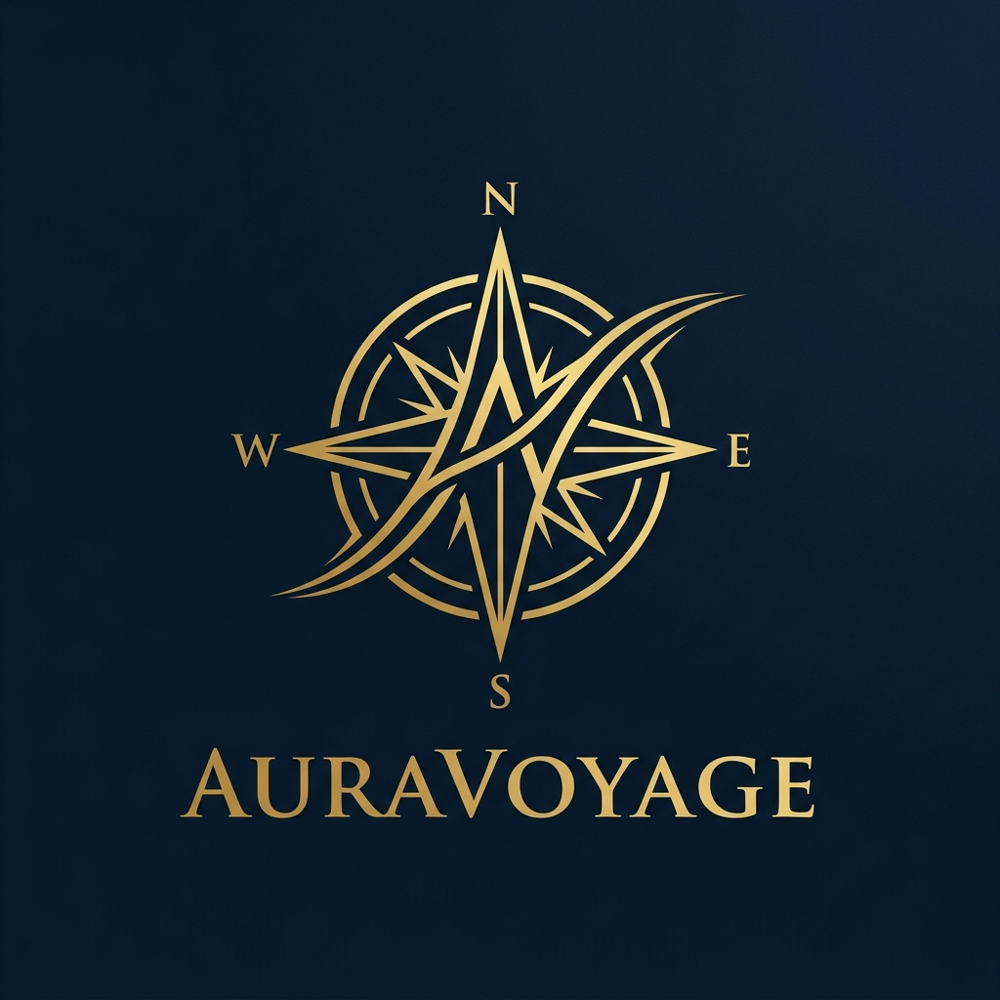
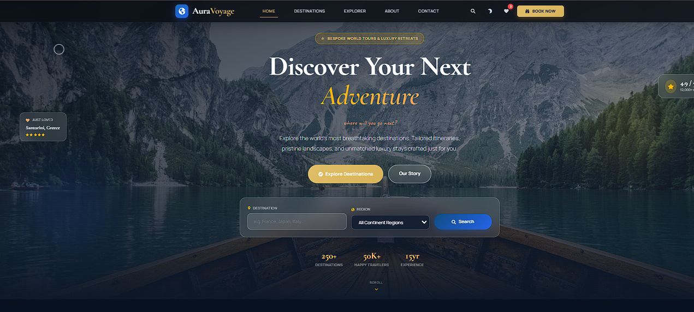

<p align="center">
  
</p>

<h1 align="center">AuraVoyage</h1>

<p align="center">
  <strong>Cinematic Luxury Travel Atelier & Private Concierge Service</strong>
</p>

<p align="center">
  <a href="#features">Features</a> •
  <a href="#design-system">Design System</a> •
  <a href="#themes">Premium Themes</a> •
  <a href="#quick-start">Quick Start</a>
</p>

<br />

<p align="center">
  
</p>

---

## 🧭 Overview

**AuraVoyage** is a cinematic, editorial React + Vite travel and tourism portal built for discerning explorers seeking bespoke global expeditions. The website merges the visual storytelling of **Condé Nast Traveler** with the responsiveness of a high-end private concierge desk.

Crafted around a custom-built, semantic theme-token system, AuraVoyage delivers consistent layouts, beautiful typography, hardware-accelerated animations, and access to private retreats.

---

## ✨ Features

- ⚜️ **Bespoke Concierge Booking** — An elegant, fully responsive expedition planner that connects guests directly to a senior travel advisor.
- 🌓 **Premium Dual-Theme Engine** — Smoothly transitions between a warm, light layout and a deep, low-contrast charcoal-navy dark theme.
- 🗺️ **World Explorer Interactive Map** — Browse countries, capital statistics, currencies, and local guidelines on a fluid geographic interface.
- 📸 **Cinematic Imagery Focus** — Curated Unsplash covers optimized with zoom transitions, balanced aspect ratios, and custom filters.
- ♿ **Accessibility (A11y) Compliant** — High contrast borders, semantic markup, and explicit `:focus-visible` outline indicators supporting keyboard navigation.
- ⚡ **Lightning Fast HMR** — Built on Vite + React 19 for instantaneous hot module replacement and standard-compliant compilation.

---

## 🎨 Design System

AuraVoyage uses a centralized design system built entirely on CSS Custom Properties. The values dynamically shift depending on the active theme:

| Semantic Token | Light Theme Value | Dark Theme Value | Purpose |
| :--- | :--- | :--- | :--- |
| `--bg-primary` | `#F8F6F2` (Warm White) | `#07111F` (Charcoal Navy) | Primary page canvas |
| `--bg-secondary` | `#FBF7F0` (Soft Beige) | `#0A1424` (Deep Charcoal) | Section backgrounds |
| `--surface` | `#ffffff` (Pure White) | `#101C2E` (Slate Blue) | Card surfaces & form fields |
| `--surface-elevated` | `#ffffff` | `#142238` | Modal panels & dropdown options |
| `--border-subtle` | `rgba(15, 76, 129, 0.12)` | `rgba(148, 163, 184, 0.08)` | Elegant border separation |
| `--text-primary` | `#0C1A2E` (Slate Blue) | `#F8F9FA` (Warm Off-White) | Dominant headings |
| `--text-secondary` | `#374151` (Charcoal) | `#CBD5E1` (Cool Light Gray) | Body text |
| `--text-muted` | `#6B7280` | `#94A3B8` | Subheadings & labels |
| `--accent-gold` | `#D8B45A` | `#E0BD68` (Luxury Gold) | Active items & star tags |
| `--accent-blue` | `#0F4C81` (Ocean Blue) | `#2563EB` (Cobalt Blue) | Secondary focus actions |

---

## 🌓 Themes

AuraVoyage provides an immersive dark mode that shifts the interface away from saturated blues or pure blacks into a refined deep navy and gold palette.

### 🌅 Light Theme
A clean, airy layout featuring soft warm off-whites, thin architectural borders, and deep slate blue headings that communicate space and premium travel craftsmanship.

### 🌃 Dark Theme
A low-contrast editorial canvas utilizing deep navy surfaces, soft charcoal-gray secondary text, and warm luxury gold details. Modals, search inputs, and dropdown panels use matching surfaces that maintain readability without blinding white boxes.

---

## 🚀 Quick Start

### 1. Clone & Install
```bash
git clone https://github.com/yourusername/auravoyage.git
cd auravoyage
npm install
```

### 2. Launch Development Server
```bash
npm run dev
```
The server will boot locally, typically at **[http://localhost:5173/](http://localhost:5173/)**.

### 3. Verify Code Quality & Build
```bash
# Run linting checks (oxlint)
npm run lint

# Compile production bundle
npm run build
```

---

<p align="center">
  Designed with dedication to the art of travel by AuraVoyage.
</p>
